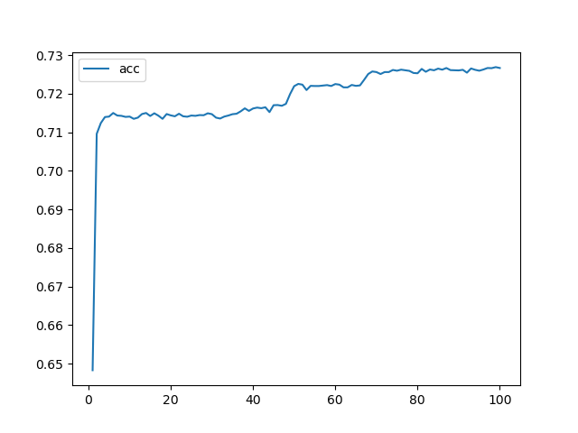
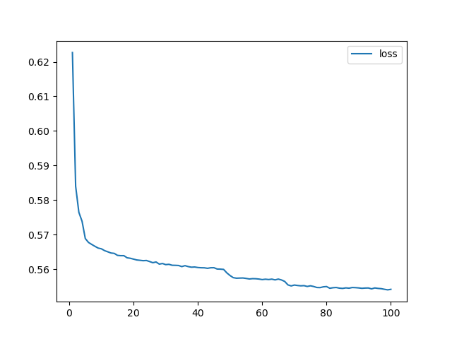
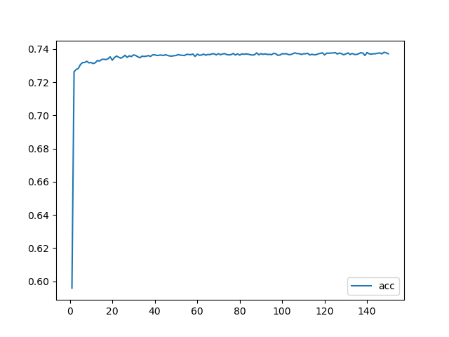
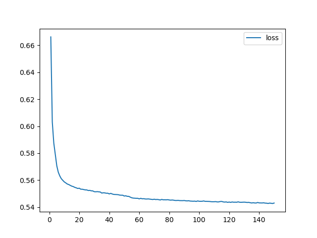

# deep-learning-challenge

## Overview

The purpose of this analysis is to build a deep neural network model for Alphabet Soup to help it select the applicants for funding with the best chance of success in their ventures. Using a dataset of past funding data of more than 34,000 organisations that have received funding from Alphabet Soup, the aim of the model is to create a binary classifier that can predict whether applicants will be successful if funded by Alphabet Soup.

## Results

* The target of the model is variable 'IS_SUCCESSFUL'
* The features for the model include variables 'ASK_AMT','APPLICATION_TYPE', 'AFFILIATION', 'CLASSIFICATION', 'USE_CASE', 'ORGANIZATION', 'INCOME_AMT', 'SPECIAL_CONSIDERATIONS'
* Variables 'EIN' and 'NAME' were removed from the input data because they are neither targets nor features
* The original model had layer 1 with 5 nodes and layer 2 with 3 nodes, epochs=100. This achieved a 72.67% accuracy. While there were 43 inputs and the general rule is to have 2-3 time the number of neurons as inputs, a small number of neurons was chosen to improve speed and processing time.
* An 85% target model performance was the aim, however, this was not achieved with the current model.
* Steps taken to optimise and increase model performance included changing the number of neurons, adding an extra layer, changing the activation function, and increasing the number of epochs.

## Summary

### Initial model

The initial model started with 2 hidden layers, consisting of 5 and 3 neurons respectively, iterated with 100 epochs. The model on training data yielded a loss of 55.42% and accuracy of 72.67%.

<br><br>
<br><br>

The model on test data yielded a loss of 56.32% and accuracy of 72.41%. The evaluation is similar across the training and testing data set.

### Optimised model

The optimised model has 3 hidden layers, with 12, 4 and 1 neuron(s) respectively, with the 3rd layer's activation method changed from relu to sigmoid and number of epochs increased to 150. This model on training data yielded a loss of 54.31% and accuracy of 73.71%.

<br><br>
<br><br>

The model on test data yielded a loss of 55.16% and accuracy of 72.91%. The evaluation is similar across the training and testing data set.

Both initial and optimised models' accuracy of the test dataset was lower than the training dataset's which may suggest a better dataset split is required. Although, the deviation between training and testing accuracy is small. As optimisation was not very successful in greatly improving accuracy levels, auto-optimisation using kerastuner is recommended to compare chosen hyperparameters. However, this requires the python environment to be updated to 3.8+.

A random forest regressor model may prove to be a better model to solve this classification problem as it is suitable for capturing non-linear relationships and can also identify key or important features.

## Load the model

```python
# Initial model
initial_model = tf.keras.models.load_model('AlphabetSoupCharity.h5')

# Show the model architecture
initial_model.summary()

# optimised model
optimised_model = tf.keras.models.load_model('AlphabetSoupCharity_Optimisation.h5')

# Show the model architecture
optimised_model.summary()
```

## References

* Data set from: IRS. Tax Exempt Organization Search Bulk Data Downloads. <https://www.irs.gov/>
* Load a model: <https://www.tensorflow.org/tutorials/keras/save_and_load>
* Campaign performance prediction <https://medium.com/@clozymwangs/marketing-campaign-performance-prediction-ed182e980676>

## Environment

Python 3.7  
Libraries required:

```python
from sklearn.model_selection import train_test_split
from sklearn.preprocessing import StandardScaler
import pandas as pd
import tensorflow as tf
import matplotlib.pyplot as plt
```
